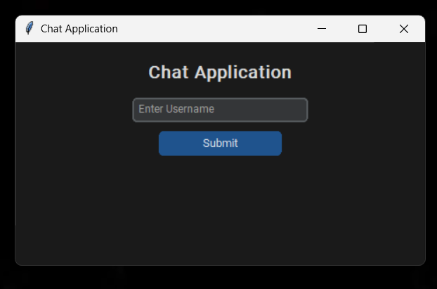
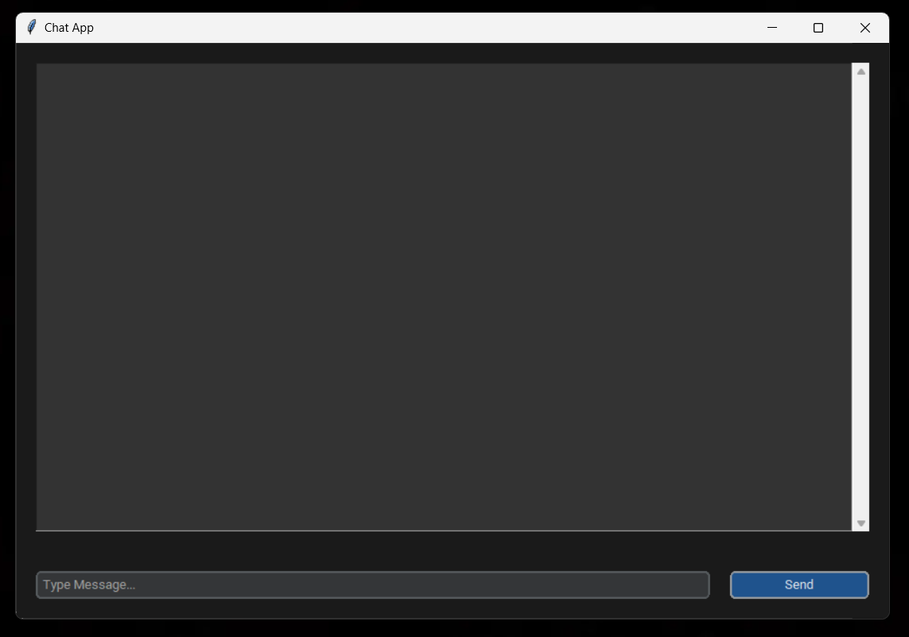
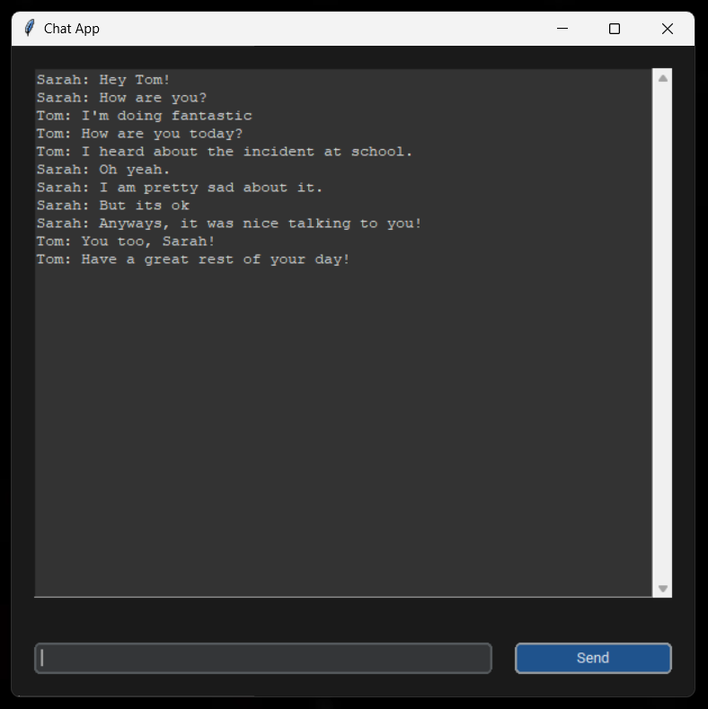
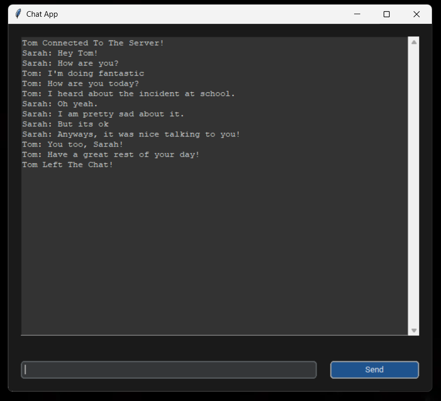

# Tkinter-Chat-App
A chat application built in Python with a user-friendly GUI and encoding/decoding for easy transmission. The server threads multiple clients into a common chat room.

## Imports
```python
import socket
import threading
import tkinter
import customtkinter
```

## GUI Screenshots







